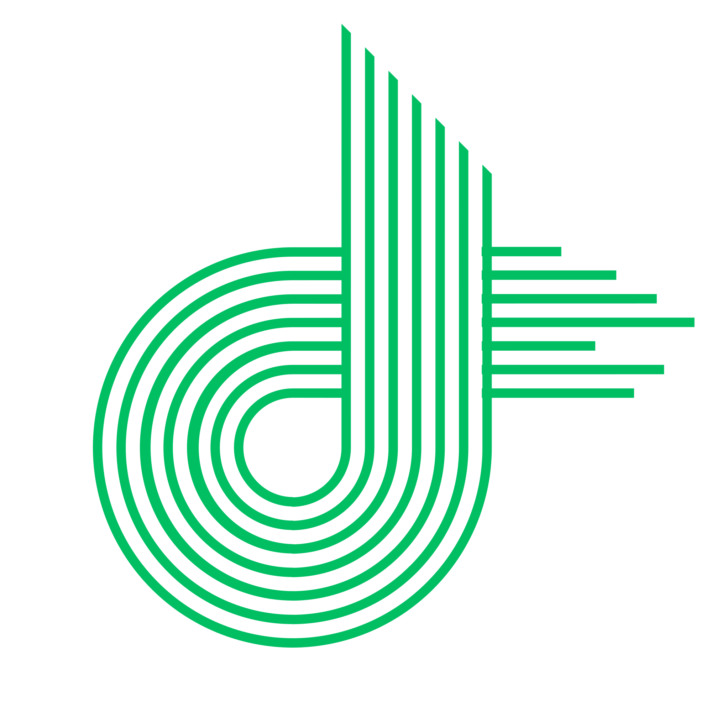

  

  

    <a href="https://github.com/DevZenMaster-inc">
      <!-- Main title -->
      
       
      <!-- Multi-line animation with cycling colors -->
      
    </a>
  

  

    
    
    
    
    
  

  <blockquote>
    <strong>"Bridging the gap between technical innovation and real-world application."</strong>
  </blockquote>

  

---

## 🏛️ Corporate Overview
**DevZenMaster** is a technology company and platform for innovation, learning, and growth. By combining expertise in IT systems, digital tools, cybersecurity, and AgriTech, DevZenMaster delivers value to clients while fostering knowledge sharing within the tech community.

- **Mission:** Provide innovative, reliable, and secure technology solutions while empowering the next generation of tech leaders.  
- **Vision:** A world where technology is accessible, safe, and effective for every community.  
- **Core Values:** Security · Innovation · Trust · Community · Quality · Excellence

---

## 🛠️ Specialized Service Pillars

<table width="100%">
  <tr>
    <td width="50%" align="left">
      <h3>💻 IT Systems & Software</h3>
      
Scalable full-stack web and mobile applications engineered for enterprise-grade efficiency.

    </td>
    <td width="50%" align="left">
      <h3>🛡️ Cybersecurity & Auditing</h3>
      
Vulnerability assessments, ethical hacking, and security-first architecture design.

    </td>
  </tr>
  <tr>
    <td width="50%" align="left">
      <h3>🌱 Smart AgriTech</h3>
      
IoT-based monitoring and AI-driven data analysis for sustainable, smart farming.

    </td>
    <td width="50%" align="left">
      <h3>🎓 Structured Learning</h3>
      
Professional mentorship and hands-on courses in DevOps, Security, and Development.

    </td>
  </tr>
</table>

---

## 🚀 Future Roadmap: 2026 & Beyond
- [ ] **AI-Predictive Farming:** Neural networks for crop yield prediction  
- [ ] **Sentinel Security:** Automated threat detection for SMEs  
- [ ] **DevZen Academy:** Full online platform for tech mastery  
- [ ] **Workflow AI:** Intelligent automation for industrial systems  
- [ ] **Open Source Contributions:** Launch community-driven repositories  

---

## 🧰 Full Tech Stack

  <h3>Frontend & Backend</h3>
  
   
  <h3>Infrastructure & Security</h3>
  

---

## 📊 Organization Stats

  
  
  
  

---

## 👥 Our Team

- **Ruwan Sanjeewa** – Founder & Lead Tech  

---

## 🤝 Let's Connect

---

## 🌍 Location

Sri Lanka

---

  

